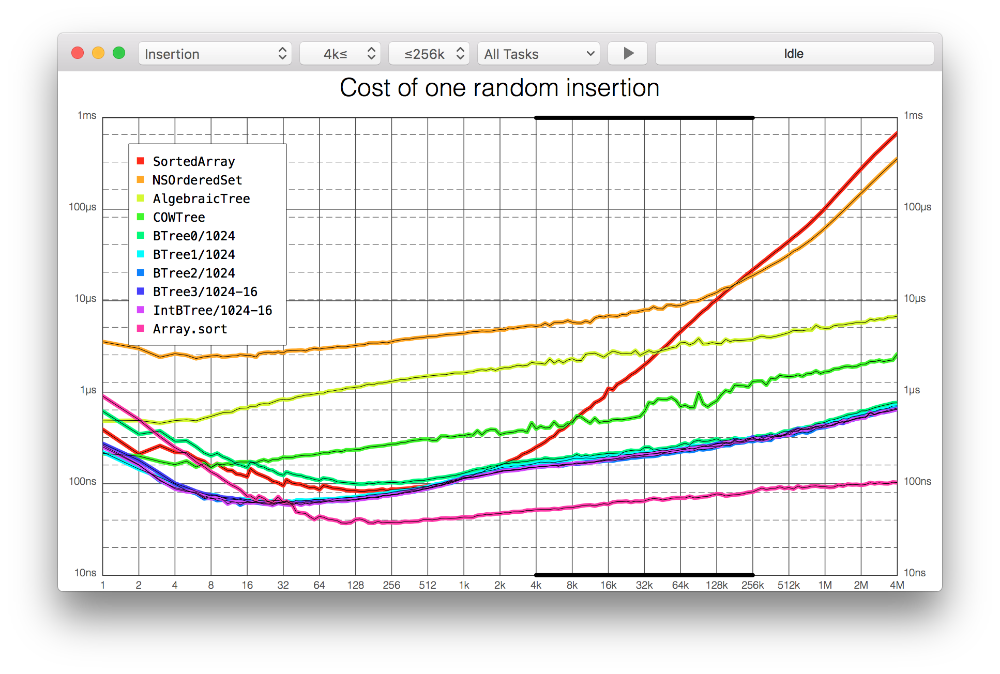

# Optimizing Swift Collections

This repository contains an overabundance of multimedia content supplementing
my [dotSwift 2017 talk about Optimizing Swift Collections][dotswift]. In this
talk, I describe several ways to implement the same simple ordered set protocol
in Swift, demonstrating how the language supports a number of surprisingly
different approaches to programming.

[dotswift]: http://www.thedotpost.com/2017/01/karoly-lorentey-optimizing-swift-collections

- _Composition:_ Solving problems using the constructs we already have.
- _Functional programming:_ Using pattern matching on algebraic data types and recursion to turn complicated algorithms into surprisingly simple code.
- _Optimized copy-on-write:_ Using procedural programming to allow direct mutations of an existing value when possible.
- _Cache-aware data structures:_ Understanding how the memory cache affects performance. Adapting our data structures to maximize spatial locality. 
- _Benchmark-based micro-optimizations:_ Adding a lot more complexity to squeeze out the final drops of performance. Manually inlining `Array`'s implementation from stdlib and messing around with unsafe buffers results in speedups of a handful of extra percentage points.

At every step, we trade additional complexity for improved runtime performance, ending on an implementation that is ludicrously fast but also quite difficult to handle.

<!-- START doctoc generated TOC please keep comment here to allow auto update -->
<!-- DON'T EDIT THIS SECTION, INSTEAD RE-RUN doctoc TO UPDATE -->
**Table of Contents**

- [The Video](#the-video)
- [The Code](#the-code)
- [The Book](#the-book)
- [The App](#the-app)

<!-- END doctoc generated TOC please keep comment here to allow auto update -->

## The Video

You can watch the video of the talk by clicking on the image below.

My slides are available on [Speaker Deck][speakerdeck].

dotSwift talks are always a joy to watch; each year they have a great selection
of speakers at excellent venues, and the organizers do an amazing job at
capturing and editing the videos. I highly recommend you check out [the rest of
this year's talks][talks], too; and if you can make it, you should not miss
attending next year's conference in person.

[speakerdeck]: https://speakerdeck.com/lorentey/optimizing-swift-collections
[talks]: http://www.thedotpost.com/conference/dotswift-2017

## The Code

This repository includes the full source code of every algorithm I discussed in
the talk:

1. [`MyOrderedSet`](./Sources/NSOrderedSet.swift): A rudimentary Swift wrapper for the `NSOrderedSet` class in Foundation.
2. [`SortedArray`](./Sources/SortedArray.swift): A simple collection storing elements in a sorted array, with O(n) insertions.
3. [`AlgebraicTree`](./Sources/AlgebraicTree.swift): A purely functional implementation of [red-black trees][rbt] using algebraic data types.
4. [`COWTree`](./Sources/COWTree.swift):
    A procedural, structs-and-classes variant of red-black trees that implements the [copy-on-write optimization][cow].
5. [`BTree`](./Sources/BTree.swift): 
    An implementation of in-memory [B-trees][btree-wiki], based on my [`BTree` package][btree].

[rbt]: https://en.wikipedia.org/wiki/Red–black_tree
[cow]: https://en.wikipedia.org/wiki/Copy-on-write
[btree-wiki]: https://en.wikipedia.org/wiki/B-tree
[btree]: https://github.com/lorentey/BTree

As a bonus, all five data structures implement `BidirectionalCollection`, and
they all have full value semantics. (This was cut from the talk to make it fit
the format.)

Note that while this repository contains nice illustrations of various coding
techniques, I don't recommend you use any of this code in your own projects. I
had to cut some corners to make sure the code remains relatively easy to
understand; full implementations would include lot more functionality that
would just obfuscate my point here. For example, none of these collections
implement support for removing elements, or in fact any of method in
`SetAlgebra` other than `contains` and `insert`.

For production-ready implementations of ordered collections, please
check out my [BTree package][btree] instead.

## The Book

I'm writing a short book to explain the implementation of each of these data
structures in detail. You can download the beta preview of the book as a
[60+-page pay-what-you-want ebook][gumroad], in nicely formatted PDF and EPUB
variants. Buying the book also gets you an Xcode Playground that includes the
entire text along with fully editable, live code. You can open the playground
in the iOS Playgrounds app, or in Xcode on Mac.

[][gumroad]

[gumroad]: https://gum.co/OptimizingCollections

(Naturally, buying the book now also gives you easy access to future updates later.)

Any amount you may choose to pay is greatly appreciated: it helps me keep
doing stuff like this rather than working on commercial projects. This book
is my first experimental step in publishing my own writing. If feedback is
encouraging, I'll definitely write more. But if you're short on money, there is
no shame in getting the book for free.

Note that the code inside this repository was actually extracted directly from
the code samples in the book.

## The App

The custom microbenchmarking app I wrote to generate my charts is called
[Attabench], and it is available in a [separate repository][Attabench]. The
insertion benchmark I demonstrated is included in the app by default, so you
can easily reproduce my results on your own computer. 

[][Attabench]

[Attabench]: https://github.com/lorentey/Attabench

Tip: try implementing
your own optimization ideas, and race them with my code! I'm sure you'll easily
beat me if you try.
